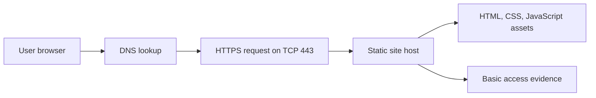

# IT Fundamentals Lab - Cloud, Security And Networking

## Overview

This mini project turns my cloud, cybersecurity, and networking self-learning into a practical IT operations lab.

The project uses a small static website as the system under review, then documents how I would deploy, secure, test, troubleshoot, and explain that system in a business environment.

## What This Demonstrates

| Area | Practical Evidence |
| --- | --- |
| Cloud fundamentals | Static website deployment model, S3-style hosting notes, GitHub Pages deployment workflow |
| Networking fundamentals | DNS, HTTP/HTTPS, TCP port 443, request path, endpoint testing |
| Cybersecurity fundamentals | Least privilege, public access review, data privacy, secure configuration checklist |
| IT operations | Troubleshooting runbook, evidence collection script, incident response notes |
| Documentation | Clear technical notes written for a non-specialist stakeholder |

## Mini Project Scenario

A small organisation wants to publish a simple public information page. The page itself is low risk, but it still needs basic operational controls:

- Visitors should reach it over HTTPS.
- Public access should expose only intended static files.
- No credentials, private data, or internal system details should be published.
- A support analyst should be able to test DNS, connectivity, and HTTP response status.
- The setup should be documented clearly enough for another person to review.

## Project Artifacts

| Artifact | Purpose |
| --- | --- |
| [Static site](site/index.html) | Small front-end system used as the lab target |
| [Architecture notes](docs/architecture.md) | Explains request flow, hosting model, and system boundaries |
| [Security review](docs/security-review.md) | Checklist for access, privacy, public exposure, and operational controls |
| [Troubleshooting runbook](docs/troubleshooting-runbook.md) | Step-by-step process for diagnosing access issues |
| [Evidence guide](evidence/README.md) | What screenshots, command outputs, and notes to collect |
| [Endpoint check evidence](evidence/endpoint-check-2026-07-01.md) | DNS, TCP 443, and HTTP 200 validation for the GitHub portfolio endpoint |
| [Network check script](scripts/Test-PortfolioEndpoint.ps1) | PowerShell script for DNS, TCP, and HTTP checks |

## Architecture Summary

## Skills Practised

- Explaining how a browser reaches a public website
- Separating DNS, TCP, TLS/HTTPS, and application response checks
- Reviewing public static content for sensitive information
- Creating a troubleshooting process that can be followed by another support analyst
- Writing security notes in a clear and practical way
- Preparing a small technical artifact for GitHub review

## Status

Completed as a GitHub-hosted mini project. The AWS S3 deployment pathway is documented as an extension task because this version avoids claiming cloud infrastructure that has not been provisioned in my AWS account.
